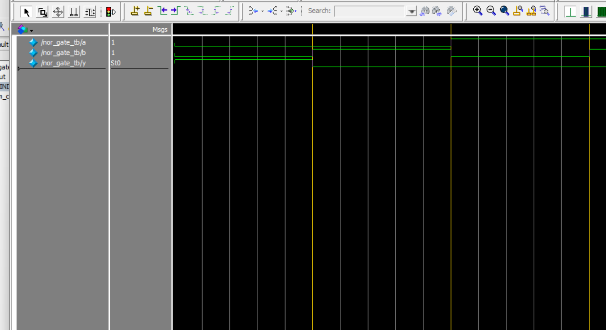

# 🔘 NOR Gate Simulation with Verilog

This project demonstrates how to implement and simulate a NOR gate using Verilog.  
The simulation is done using **ModelSim**, and waveform output is included.

---

## 📁 Files

| File Name             | Description |
|----------------------|-------------|
| `nor_gate.v`         | Verilog design of the NOR gate |
| `nor_gate_tb.v`      | Testbench for simulation |
| `nor_gate.vcd`       | VCD file generated by ModelSim |
| `monitor_log_nor.txt`| Simulation output written via `$fwrite` |
| `wave_nor_tb.png`    | Waveform image from ModelSim |
| `README.md`          | Project documentation |

---

## 🔍 Waveform Preview

Below is the simulation waveform generated by ModelSim:



---

## ▶️ Simulation Commands (ModelSim)

```tcl
vlib work
vlog src/nor_gate.v tb/nor_gate_tb.v
vsim work.nor_gate_tb
add wave *
run -all
```

Output will include:
1.monitor_log_nor.txt – textual simulation output
2.nor_gate.vcd – waveform file viewable in ModelSim
